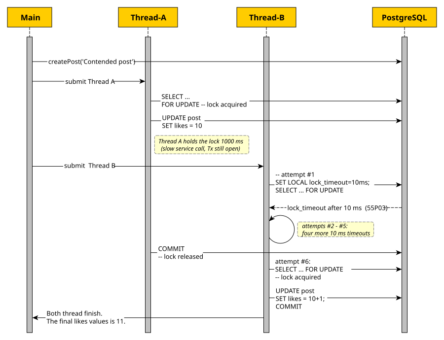

= Enhancing Spring and Hibernate with Hypersistence Utils
Vlad Mihalcea
:source-language: java
:sourcedir: {examplesdir}

In this chapter, we are going to see how https://github.com/vladmihalcea/hypersistence-utils[Hypersistence Utils] extends both Spring and Hibernate capabilities,
and provides you with a set of utilities that address certain shortcomings of these two frameworks.

While Hibernate provides great support for mapping the most common SQL column types,
and since version 6, you also have support for JSON and array columns,
there are still gaps that the library tries to fill.
Some of them are non-standard column types Hibernate does not map on its own,
such as multi-dimensional arrays, PostgreSQL ranges, intervals, and `hstore`.
Others are Java types Hibernate omits, such as `MonetaryAmount`.

In fact, this is exactly the reason why most Java developers got to know this OSS library in the first place.
When it was released in 2017 (under the name of Hibernate Types),
it provided support for mapping JSON columns in PostgreSQL, MySQL, Oracle, and SQL Server.
While the custom Hibernate Types are still the most popular feature offered by this framework,
it now provides many other Hibernate-related enhancements,
such as the time-sorted pseudo-random identifiers,
or a new `BatchSequenceGenerator` that allows you to fetch multiple sequence values in a single roundtrip from a database sequence that has an increment step of just 1.

And Hypersistence Utils is no longer limited to enhancing Hibernate since it also provides a set of Spring utilities that can improve your data access layer,
such as a better repository contract that removes the `SELECT` before every detached update,
a retry aspect that can repeat a transaction only when it is worth retrying,
and a set of query utilities that allow you to find out what SQL your application actually runs,
and which line of your code triggered it.

Next, we are going to walk through the parts worth knowing,
and each feature is grouped by category: enhanced **identifiers**,
the **column types** Hibernate cannot map on its own,
and the **Spring utilities** that improve the data access layer beyond what Spring Data JPA can offer.

Every code listing you are about to read is included at build time from an actual integration test in this book's coding repository.
None of the code is retyped, so it cannot drift from what is actually tested,
and the SQL statements shown next to it are captured from those same test runs.
I've used this practice when writing the Hibernate User Guide since it is the most efficient way to be sure that the code you read is correct and works as it's supposed to.

== Adding the library

Hypersistence Utils ships one artifact per Hibernate line,
and you must match the one your project is using.
This book uses Hibernate 7.4, and since the library has no dedicated line for it yet,
the artifact is the most recent one, `hypersistence-utils-hibernate-73`, which is compatible with the 7.4 line.
Its version is set once, as a Maven property, just like for the Hibernate one:

[source,xml]
----
include::{sourcedir}/pom.xml[tag=hypersistence-utils-version,indent=0]
----

The dependency itself is declared in the parent POM's `dependencyManagement`,
so every example project in this chapter inherits it without repeating the version:

[source,xml]
----
include::{sourcedir}/pom.xml[tag=hypersistence-utils-dependency,indent=0]
----

The examples used in this chapter model a bookstore discussion forum.
A `Post` is a thread, a `PostComment` is a reply,
and the `PostDetails` carries additional information for the thread.
There is also a `Tag` that can label threads of discussion.
As an entity, the **`Post` is the aggregate root**,
while the `PostDetails` and `PostComment` never exist without an associated `Post`.
If there is no thread, there is no reason to hold any additional details.

== Identifiers

Every entity needs a primary key, and there are multiple options you can choose from.
If your entity has a natural key, you can use it as the identifier, like the ISBN of a book.
Among our entities, the `Tag` has a natural key, which is its name,
so we could use that as the identifier.
However, even for the `Tag`, we are going to use a surrogate key instead,
because we can choose a more compact numerical representation that is more efficient for the database to index and query.

For the rest of the entities, we have no natural key, so we need to use a surrogate key instead,
and, based on where the identifier generation takes place, we can have:

* Application-generated identifiers, such as `UUID`.
* Database-generated identifiers, such as `IDENTITY` or `SEQUENCE`,
which are covered by the SQL Standard and supported by many relational database systems.

For both categories of identifier generators,
the Hypersistence Utils library provides alternatives that can be more efficient and more flexible than the standard solutions supported by Hibernate:

* A client-generated, time-sorted identifier,
inspired by the https://en.wikipedia.org/wiki/Snowflake_ID[Snowflake identifier] that https://blog.x.com/engineering/en_us/a/2010/announcing-snowflake[Twitter] used to overcome the fact that Cassandra didn't have a sequential identifier generator.
* A bulk-fetch sequence identifier generator that,
unlike the Hibernate `pooled` and `pooled-lo` identifier generators,
can use a database sequence that has an increment size of one,
leaving no gaps when the sequence is used by other clients, such as ETL jobs or database triggers.

=== Identifiers that sort themselves: `@Tsid`

For application-generated identifiers, UUIDs are very convenient because, at 128 bits, they are effectively unique,
and many programming languages either offer built-in support or have popular libraries you can use to generate them.
Unfortunately, the most common UUID type is version 4, which is purely random, and that's not very convenient
because primary keys are usually indexed, and the most common option is the B+Tree index.
Because B+Tree indexes are sorted data structures, random values will cause the index to be sparsely populated.
For example, a PostgreSQL index node is mapped in memory on an 8 KB page that may contain hundreds of entries.
When you insert a new row with a random UUID, the database has to find the right page to place it on,
and if that page is full, it splits into new nodes to keep the tree balanced,
so the index ends up with many sparsely populated pages.

To solve the randomness problem, the TSID (Time-Sorted Identifier) uses the current timestamp to fill in the first bytes of the identifier,
so newer values are increasing monotonically with time.
So, for a B+Tree index, this means that newer identifiers will be appended in the last leaf node of the current index, after the previously inserted value,
therefore filling the index pages continuously.

The second part of the identifier is filled with a random number.
Because the TSID, like the Snowflake identifier, has 64 bits, it fits in a `bigint` column, which is twice as compact as a UUID.

To use a TSID as an entity identifier, you have to use the `@Tsid` annotation, as illustrated by the following example:

.Applying a TSID to an identifier
[source,java]
----
include::{sourcedir}/HibernateSpringBootTsidIdentifier/src/main/java/com/bookstore/forum/entity/Post.java[tag=tsid,indent=0]
----

The identifier value is generated at flush time, before the `INSERT` reaches the database,
and that is the property that matters most:

.Client-side generation keeps batching alive
[source,java]
----
include::{sourcedir}/HibernateSpringBootTsidIdentifier/src/test/java/com/bookstore/forum/PostBatchInsertTest.java[tag=batching,indent=0]
----

When running the above test case, Hibernate will generate the following statement:

[source,sql]
----
Type:Prepared, Batch:True, QuerySize:1, BatchSize:30,
Query:["insert into post (title,id) values (?,?)"],
Params:[
  (Post nr. 1,877183623477788849),(Post nr. 2,877183623553286332),
  (Post nr. 3,877183623553286333),(Post nr. 4,877183623557480501),
  ...
  (Post nr. 29,877183623574257779),(Post nr. 30,877183623574257780)
]
----

Although we saved thirty posts, there was just **one** `INSERT`, which executed in a single JDBC batch.

==== Using TSID for external identifiers

`@Tsid` is not limited to the entity identifier.
It can also populate a `String` or a `TSID` column,
which can be used as public-facing identifiers that you'd exchange with a client.

.A TSID as a public identifier and as a typed column
[source,java]
----
include::{sourcedir}/HibernateSpringBootTsidIdentifier/src/main/java/com/bookstore/forum/entity/PostDetails.java[tag=tsid-attribute-types,indent=0]
----

=== Sequences that stay usable by everyone

While fetching a sequence value using a call to the database is fine for an OLTP transaction that creates a few records,
this might be very inefficient for a batch processing task that has to insert thousands of records.

For this purpose, Hibernate provides the `pooled` and `pooled-lo` sequence optimizers,
which use a database sequence that has a higher increment step (e.g., `INCREMENT BY 50`).
When the sequence generator runs out of values, it calls the sequence, and then it can generate
N entity identifiers in memory (N is the sequence increment step).

While this strategy works fine for Hibernate, any other client (e.g., an ETL job, a `psql` script, or a trigger)
that calls `nextval` on the same database sequence will take one identifier and throw away forty-nine identifier values,
because the pooling optimizer lives in the application, not in the database.

`BatchSequenceGenerator` addresses this shortcoming by *fetching* the actual sequence values from the database
using a recursive CTE, or `generate_series` on PostgreSQL, to draw N values in one statement:

.Two mappings of one table, sharing one sequence
[source,java]
----
include::{sourcedir}/HibernateSpringBootBatchSequenceGenerator/src/main/java/com/bookstore/forum/entity/Post.java[tag=oltp-sequence,indent=0]
----

[source,java]
----
include::{sourcedir}/HibernateSpringBootBatchSequenceGenerator/src/main/java/com/bookstore/forum/entity/BatchedPost.java[tag=batch-sequence,indent=0]
----

Both the `Post` and the `BatchedPost` entities fetch the identifier values from the `batch_seq_post_seq` sequence, but the OLTP `Post` mapping takes one value at a time,
while the `BatchedPost` entity fetches ten per roundtrip:

[source,java]
----
include::{sourcedir}/HibernateSpringBootBatchSequenceGenerator/src/test/java/com/bookstore/forum/BatchSequenceGeneratorTest.java[tag=batch-import,indent=0]
----

When executing the above test case, Hibernate generates the following SQL statements:

[source,sql]
----
Type:Prepared, Batch:False, QuerySize:1, BatchSize:0,
Query:["SELECT nextval('batch_seq_post_seq') FROM generate_series(1, ?)"],
Params:[(10)]

Type:Prepared, Batch:True, QuerySize:1, BatchSize:10,
Query:["insert into batch_seq_post (title,id) values (?,?)"],
Params:[
  (Imported post 1,1),
  (Imported post 2,2),
  ...
  (Imported post 9,9),
  (Imported post 10,10)
]
----

And, with the `BatchSequenceGenerator` in place,
a script that knows nothing about Hibernate can still interleave with the application:

[source,java]
----
include::{sourcedir}/HibernateSpringBootBatchSequenceGenerator/src/test/java/com/bookstore/forum/BatchSequenceGeneratorTest.java[tag=interop,indent=0]
----

When running the above code example, we get the following SQL statements:

[source,sql]
----
Query:["select nextval('batch_seq_post_seq')"], Params:[()]
Query:["insert into batch_seq_post (title,id) values (?,?)"],
Params:[(Written by the application,1)]

Query:["select nextval('batch_seq_post_seq')"], Params:[()]
Query:["insert into batch_seq_post (id, title) values (?, ?)"],
Params:[(2,Written by an ETL job)]

Query:["select nextval('batch_seq_post_seq')"], Params:[()]
Query:["insert into batch_seq_post (title,id) values (?,?)"],
Params:[(Written by the application again,3)]
----

When examining the sequences, we can see that a `pooled` optimizer redefines the increment step of its own sequence,
so `pooled_post_seq` uses `50`,
while `batch_seq_post_seq`, shared by both `Post` and `BatchedPost`, keeps an increment size of `1`:

[source,java]
----
include::{sourcedir}/HibernateSpringBootBatchSequenceGenerator/src/test/java/com/bookstore/forum/BatchSequenceGeneratorTest.java[tag=increments,indent=0]
----

[NOTE]
====
`@BatchSequence` is not gap-free in all circumstances.
The unused values that were fetched by a given transaction will be lost if the
transaction rolls back.
====

== Hibernate Types

This is the gap the Hypersistence Utils library is best known for.
Hibernate 7 maps the SQL-standard types and, increasingly, the common vendor extensions (e.g., JSON, arrays, inet).
However, some databases, such as PostgreSQL, have a great variety of column types that are left for you to map via
the Hibernate custom type API, and Hypersistence Utils aims to help you with this task, by providing additional
Hibernate Types for ranges, intervals, monetary amounts, or key/value maps.

Even for the types that Hibernate has added support for in recent versions, such as JSON and arrays, Hypersistence Utils
can provide some additional features. For example, the generic `JsonType` can work with PostgreSQL, Oracle, SQL Server, or MySQL,
without you having to change the entity mapping. And the `MultiDimensionalArrayType` can handle nested arrays, which may be convenient
for some applications.

Nevertheless, where Hibernate 7 or 6 has since caught up, we are going to mention it,
because the honest advice is that you no longer need the library for some of the types that have been
traditionally offered by Hypersistence Utils.

=== JSON columns, portably

It's common to assume that the SQL standard defines only columns that strictly adhere to the relational model.
However, while most column types are based on the relational model, the SQL standard takes into consideration
application needs, and, from time to time, adds support for non-relational models.

For example, SQL:2003 added support for the XML data type since XML was very popular around that time.
And because JSON has become a very common data representation, SQL:2016 added support for storing JSON objects in
`VARCHAR`, `CLOB`, or `BLOB` column types, which was further improved in SQL:2023 via native JSON types.

Some relational databases had been supporting JSON types even before 2016.
PostgreSQL was one of the first relational databases to support JSON, adding support for a `json` column in 9.2 (2012)
for storing JSON objects in a text-based storage, and a `jsonb` column in 9.4 (2014) that can store JSON objects
in a binary format. MySQL added the `json` column type in 2015 with the 5.7.8 release.

Having so many options to store JSON objects, the `JsonType` aims to remove this burden from the Java developer,
and allows you to map a POJO, a `String`, a `JsonNode`, a `Map`, or a `List` to the aforementioned database-specific JSON storage types.

.`JsonType` mapping example
[source,java]
----
include::{sourcedir}/HibernateSpringBootJsonType/HibernateSpringBootJsonTypeAttributes/src/main/java/com/bookstore/forum/entity/Post.java[tag=json-columns,indent=0]
----

Every JSON entity in this section also carries `@DynamicInsert` and `@DynamicUpdate` at the class level:

.The JSON entities use dynamic insert and update
[source,java]
----
include::{sourcedir}/HibernateSpringBootJsonType/HibernateSpringBootJsonTypeAttributes/src/main/java/com/bookstore/forum/entity/Post.java[tag=dynamic,indent=0]
----

`@DynamicInsert` limits each `INSERT` to the columns we actually populate,
while `@DynamicUpdate` keeps a column out of the `UPDATE` unless its value changed.
This is especially relevant for JSON columns since a document can be large, and we do not want to re-send it on every flush when only another column changed.
Because of these two annotations, the SQL statements captured throughout this section list only the columns that are actually written.

The reason we're using the `columnDefinition = "json"` on the columns annotated with `JsonType` is because
this Hibernate Type maps to the JDBC `Types.OTHER`, which Hibernate cannot turn into a column type on its own,
so the schema generator does not know what DDL type to emit for the column unless we tell it.
If you leave the `columnDefinition` out, the schema generation fails with the following exception:

[source,text]
----
Unable to determine SQL type name for column 'attributes' of table 'post'
because there is no type mapping for org.hibernate.type.SqlTypes code: 1111 (OTHER)
----

This is a limitation of Hibernate's `hbm2ddl` schema generation only, and it's not as bad as it looks.
The `hbm2ddl` tool is a prototyping aid, not something you should run in production,
where the schema is versioned and migrated by a dedicated tool like Flyway or Liquibase.
And once the schema is created before the application bootstraps, `JsonType` no longer needs the `columnDefinition`,
because, at runtime, it already knows how to read and write the JSON column for the underlying database.

To prove that, the following entity maps its JSON attributes with `JsonType` and no `columnDefinition` at all:

.A `JsonType` mapping without any `columnDefinition`
[source,java]
----
include::{sourcedir}/HibernateSpringBootJsonType/HibernateSpringBootJsonTypePortability/src/main/java/com/bookstore/forum/entity/Post.java[tag=json-no-columndef,indent=0]
----

The schema is created up front by a migration script that runs before Hibernate bootstraps,
which is exactly what Flyway would do for you in production:

.The migration script that creates the JSON schema on PostgreSQL
[source,sql]
----
include::{sourcedir}/HibernateSpringBootJsonType/HibernateSpringBootJsonTypePortability/src/main/resources/schema-postgresql.sql[tag=schema-postgresql,indent=0]
----

Based on the underlying relational database, `JsonType` binds the JSON attribute to the column type that best fits the database's native JSON support:

.The JSON column type that `JsonType` binds for each database
[cols="1,2", options="header"]
|===
| Database | Column type

| MySQL | `json`, bound as text
| PostgreSQL | `jsonb`, bound as a binary object
| SQL Server | `nvarchar(max)`, bound as text
| Oracle | native `json`, bound as bytesfootnote:[This is what Oracle 21c and newer use. Below 21c, `JsonType` binds JSON as text, where a `clob` column fits.]
|===

Hibernate 7 has native JSON support of its own, through `@JdbcTypeCode(SqlTypes.JSON)`,
and, most often, you are better off preferring it.
It is dialect-aware, it needs no `columnDefinition`, and it works on all four major databases (PostgreSQL, Oracle, SQL Server, and MySQL).
The book code repository carries both variants side by side so you can compare them.
The same five columns, mapped with `@JdbcTypeCode(SqlTypes.JSON)` instead of `@Type(JsonType.class)`, look like this:

.Native Hibernate JSON mapping example
[source,java]
----
include::{sourcedir}/HibernateSpringBootJsonType/HibernateSpringBootNativeJsonAttributes/src/main/java/com/bookstore/forum/entity/Post.java[tag=json-columns,indent=0]
----

Unlike `JsonType`, the native mapping does not need a `columnDefinition`,
because the dialect already knows which column type to use for a JSON attribute.
Therefore, the schema that Hibernate generates picks the right storage type for each database:

.Default JSON column type generated by `@JdbcTypeCode(SqlTypes.JSON)`
[cols="1,2", options="header"]
|===
| Database | Generated column type

| MySQL | `json`
| PostgreSQL | `jsonb`
| SQL Server | `nvarchar(max)`
| Oracle | `blob` with an `is json` check constraintfootnote:[On Oracle 21c and newer, the native `json` column type is used instead.]
|===

On Hibernate 7, the native JSON mapping and the Hypersistence Utils `JsonType` overlap significantly, but they are not interchangeable.
The following table sums up how they compare:

.`@Type(JsonType.class)` versus native `@JdbcTypeCode(SqlTypes.JSON)`
[cols="1,2,2", options="header"]
|===
| | `@Type(JsonType.class)` | `@JdbcTypeCode(SqlTypes.JSON)`

| Java attribute types | POJO, `JsonNode`, `Map`, `String`, `List` | POJO, `JsonNode`, `Map`, `String`, `List`
| `hbm2ddl` schema generation | needs a `columnDefinition` | works on its own, dialect-aware
| Schema from a migration tool | no `columnDefinition` needed | no `columnDefinition` needed
| Dirty checking | content-based, skips no-op `UPDATE` statements | identity-based, issues redundant `UPDATE` statements
| Hibernate version | 5 and newer | 6 and newer
|===

If you let Hibernate generate the schema for a plain document column, the native mapping is the simpler choice.
The one behavior that still sets `JsonType` apart is how the two mappings handle dirty checking.

`JsonType` compares the *parsed* JSON content when deciding whether the entity attribute has changed,
so loading an entity and leaving its JSON attribute untouched,
or updating the attribute with the same content, does not trigger an `UPDATE`:

.`JsonType` skips the UPDATE when the JSON content is unchanged
[source,java]
----
include::{sourcedir}/HibernateSpringBootJsonType/HibernateSpringBootJsonTypeAttributes/src/test/java/com/bookstore/forum/JsonTypeAttributesTest.java[tag=dirty-checking,indent=0]
----

Running the three scenarios above, `JsonType` loads the row each time, but only the genuine content change triggers an `UPDATE`:

.The SQL statements `JsonType` executes
[source,sql]
----
-- touch(id): the row is loaded, and the transaction commits unchanged
Query:["
select p1_0.id,p1_0.attributes,p1_0.metadata,
       p1_0.properties,p1_0.raw_payload,p1_0.tags,p1_0.title
from post p1_0
where p1_0.id=?"],
Params:[(877435976001019965)]
-- no UPDATE is flushed

-- update(..., p.setProperties(pinnedProperties())): a new instance, but equal content
Query:["
select p1_0.id,p1_0.attributes,p1_0.metadata,
       p1_0.properties,p1_0.raw_payload,p1_0.tags,p1_0.title
from post p1_0
where p1_0.id=?"],
Params:[(877435976001019965)]
-- still no UPDATE

-- update(..., p.getProperties().setFlair("hot")): a real content change
Query:["
select p1_0.id,p1_0.attributes,p1_0.metadata,
       p1_0.properties,p1_0.raw_payload,p1_0.tags,p1_0.title
from post p1_0
where p1_0.id=?"],
Params:[(877435976001019965)]

Query:["update post set properties=? where id=?"],
Params:[(
  {"flair":"hot","attachments":["table-of-contents.pdf"],"pinned":true},
  877435976001019965
)]
----

The Hibernate-native JSON mapping compares object identity instead of content,
so a mutable POJO without an `equals` method will trigger an `UPDATE` on every flush,
even when nothing actually changed:

.The native mapping issues a redundant UPDATE for an unchanged POJO
[source,java]
----
include::{sourcedir}/HibernateSpringBootJsonType/HibernateSpringBootNativeJsonAttributes/src/test/java/com/bookstore/forum/NativeJsonAttributesTest.java[tag=redundant-update,indent=0]
----

The very same two scenarios now flush an `UPDATE` each, even though the JSON content never changes:

.The SQL statements the native mapping executes
[source,sql]
----
-- touch(id): the row is loaded, and the transaction commits unchanged
Query:["
select p1_0.id,p1_0.attributes,p1_0.metadata,
       p1_0.properties,p1_0.raw_payload,p1_0.tags,p1_0.title
from post p1_0
where p1_0.id=?"],
Params:[(1)]
-- ...yet the native mapping still flushes an UPDATE for the unchanged properties
Query:["update post set properties=cast(? as json) where id=?"],
Params:[({"pinned":true,"flair":"must-read","attachments":["table-of-contents.pdf"]},1)]

-- update(..., p.setProperties(pinnedProperties())): a new instance, but equal content
Query:["
select p1_0.id,p1_0.attributes,p1_0.metadata,
       p1_0.properties,p1_0.raw_payload,p1_0.tags,p1_0.title
from post p1_0
where p1_0.id=?"],
Params:[(1)]
-- ...and the UPDATE fires again, for the very same properties content
Query:["update post set properties=cast(? as json) where id=?"],
Params:[({"pinned":true,"flair":"must-read","attachments":["table-of-contents.pdf"]},1)]
----

The reason for these unwanted `UPDATE` statements lies in how Hibernate dirty-checks a mutable attribute.
When the entity is loaded, Hibernate takes a snapshot of its state and keeps it in the persistence context,
and for a mutable attribute like a JSON column, that snapshot is a *deep copy* of the loaded value.
So the managed entity and its snapshot end up holding two different `PostProperties` instances.

At flush time, the dirty-checking mechanism compares the entity's current value against that snapshot,
and since `PostProperties` does not override `equals`, the comparison falls back to object identity.
The two instances are never identity-equal, so Hibernate concludes the attribute has changed and issues an `UPDATE`,
even when the serialized JSON is byte-for-byte the same.
This is why the `touch` method triggers an `UPDATE` even though it doesn't change the entity.
The entity JSON attribute is a different object instance from the loaded value the moment the entity finishes loading.

Thanks to `@DynamicUpdate`, the redundant `UPDATE` is narrowed to the `properties` column alone,
which is the one JSON attribute mapped to a POJO that lacks an `equals`;
a column backed by a `Map`, `List`, `String` or `JsonNode` has value-based equality, so it would be spared even if it were populated.

On the other hand, `JsonType` can omit these unnecessary `UPDATE` statements, because it compares the *JSON content* rather than object identity,
so the two instances are seen as equal and no `UPDATE` is flushed.
If you prefer the native mapping, you are better off overriding the `equals` and `hashCode` method of the POJO class wrapping the JSON content.
This way, the dirty checking mechanism will detect that the object content has not changed and not trigger the extra `UPDATE` statements.

==== How to provide a custom `ObjectMapper`

Both mappings serialize through Jackson, and both let you replace the default mapper with one of your own.
`JsonType` takes an `ObjectMapperSupplier`, wired in through a Hypersistence Utils property,
while the native feature takes a Hibernate `FormatMapper`, wired in through a Hibernate property:

[source,properties]
----
# Hypersistence Utils
spring.jpa.properties.hypersistence.utils.jackson.object.mapper=\
  com.bookstore.forum.config.CustomObjectMapperSupplier

# Native Hibernate
spring.jpa.properties.hibernate.type.json_format_mapper=\
  com.bookstore.forum.config.CustomJsonFormatMapper
----

To see how a custom mapper can change the JSON object prior to persisting it into the database,
we are going to create a custom mapper that renames the field names from `camelCase` to `snake_case`
and omits all JSON attributes that contain `null` values.
Both examples store the same POJO payload, which has a couple of camelCase fields
and two `java.time` timestamps, one of which is left `null`:

.The JSON payload POJO
[source,java]
----
include::{sourcedir}/HibernateSpringBootJsonType/HibernateSpringBootJsonTypeObjectMapper/src/main/java/com/bookstore/forum/entity/PostProperties.java[tag=fields,indent=0]
----

The `snake_case` strategy renames `flairLabel` to `flair_label`,
and `NON_NULL` inclusion drops the `editedOn` JSON attribute from the stored document when it contains a `null` value.
Both examples build the same `Post`, set the payload above, and save it,
so the only thing that differs is which mapping serializes it.

Before we look at each side, note what we did *not* have to configure.
On Jackson 3, `java.time` values serialize to ISO-8601 strings out of the box,
so an `OffsetDateTime` no longer needs the `JavaTimeModule` and the `WRITE_DATES_AS_TIMESTAMPS` tweak that Jackson 2 required.
Reading is lenient by default, too.
A JSON document that carries an extra key that your POJO does not map is accepted rather than rejected,
which is exactly what you want for a column whose shape evolves over time.
The mapper therefore configures only the two things that actually differ from the Jackson 3 defaults.

===== JsonType

On the `JsonType` side, the supplier builds the mapper:

.Custom `ObjectMapper` for `JsonType`
[source,java]
----
include::{sourcedir}/HibernateSpringBootJsonType/HibernateSpringBootJsonTypeObjectMapper/src/main/java/com/bookstore/forum/config/CustomObjectMapperSupplier.java[tag=mapper,indent=0]
----

The test builds the `Post`, sets the camelCase payload, and saves it:

.Saving a `Post` whose JSON is serialized by the custom `ObjectMapper`
[source,java]
----
include::{sourcedir}/HibernateSpringBootJsonType/HibernateSpringBootJsonTypeObjectMapper/src/test/java/com/bookstore/forum/JsonTypeObjectMapperTest.java[tag=save,indent=0]
----

When the transaction flushes, the custom mapper serializes the POJO,
and Hibernate sends the following `INSERT`, whose bind parameter carries the transformed JSON:

.The SQL statement JsonType executes
[source,sql]
----
Query:["
insert into object_mapper_post (properties,title,id)
values (?,?,?)"],
Params:[(
  {"flair_label":"must-read","pinned_by_moderator":true,"created_on":"2026-08-18T09:45:00Z"},
  Custom ObjectMapper for JsonType,
  1
)]
----

The stored JSON uses `snake_case` keys, an ISO-8601 `created_on` timestamp, and no `edited_on` attribute at all.

===== Hibernate native

The Hibernate native solution uses the very same mapper and hands it to Hibernate's `Jackson3JsonFormatMapper`,
delegating the remaining `FormatMapper` methods to that instance:

.Custom `FormatMapper` for the native mapping
[source,java]
----
include::{sourcedir}/HibernateSpringBootJsonType/HibernateSpringBootNativeJsonFormatMapper/src/main/java/com/bookstore/forum/config/CustomJsonFormatMapper.java[tag=mapper,indent=0]
----

The test is identical to the previous `JsonType` example, except that the JPA entity mapping
uses the native `@JdbcTypeCode(SqlTypes.JSON)` instead of `@Type(JsonType.class)`:

.Saving a `Post` whose JSON is serialized by the custom `FormatMapper`
[source,java]
----
include::{sourcedir}/HibernateSpringBootJsonType/HibernateSpringBootNativeJsonFormatMapper/src/test/java/com/bookstore/forum/NativeJsonFormatMapperTest.java[tag=save,indent=0]
----

While the bind parameter values are identical to the previous `JsonType` example,
the native mapping wraps the JSON bind parameter in a `cast(? as json)` expression:

.The SQL statement the native mapping executes
[source,sql]
----
Query:["
insert into format_mapper_post (properties,title,id)
values (cast(? as json),?,?)"],
Params:[(
  {"flair_label":"must-read","pinned_by_moderator":true,"created_on":"2026-08-18T09:45:00Z"},
  Custom FormatMapper for native JSON,
  1
)]
----

Nevertheless, both mappings produce identical JSON objects, in spite of the additional `cast(? as json)`.

==== Polymorphic JSON structures

Let's assume that we have a variety of content blocks (e.g., text, image, code snippets) that the user
can add to a given post.
Because we are going to save the content blocks in a JSON object, we need a Jackson discriminator
to identify the type of each block when reading it back from the database.
For this reason, we are going to use the `@JsonTypeInfo` annotation on the base class of the content blocks,
as illustrated by the following mapping:

.The discriminator has to be a real bean property
[source,java]
----
include::{sourcedir}/HibernateSpringBootJsonType/HibernateSpringBootJsonTypePolymorphism/src/main/java/com/bookstore/forum/entity/PostContentBlock.java[tag=discriminator,indent=0]
----

Since the discriminator is exposed as a genuine bean property,
we need the `As.EXISTING_PROPERTY` option to tell Jackson to use the `type` property rather than adding a new one.

Both the native `@JdbcTypeCode(SqlTypes.JSON)` and `JsonType` mappings can handle polymorphic JSON structures.
The following example uses the PostgreSQL-specific `JsonBinaryType`, which stores the content blocks in a `jsonb` column.

The test builds a `Post` whose body mixes all three block types, and saves it:

.Persisting a polymorphic list of content blocks
[source,java]
----
include::{sourcedir}/HibernateSpringBootJsonType/HibernateSpringBootJsonTypePolymorphism/src/test/java/com/bookstore/forum/JsonTypePolymorphismTest.java[tag=persist,indent=0]
----

The whole list is serialized into a single `jsonb` column,
and each element carries the `type` discriminator (`text`, `code`, `image`) that lets it be revived later:

.The SQL statement that persists the polymorphic JSON
[source,sql]
----
Query:["
insert into polymorphic_post (body,title,id)
values (?,?,?)"],
Params:[(
  [
    {"markdown":"Intro paragraph","type":"text"},
    {"language":"java","source":"var x = 1;","type":"code"},
    {"url":"https://example.com/a.png","alt":"a diagram","type":"image"}
  ],
  Mapping polymorphic JSON,
  1
)]
----

When we read the `Post` back, Jackson uses the `type` discriminator to reconstruct each element as its concrete subtype
(e.g., `TextBlock`, `CodeBlock`, and `ImageBlock`), so the list comes back exactly as it was prior to being persisted:

.Fetching the post and asserting each block's concrete type
[source,java]
----
include::{sourcedir}/HibernateSpringBootJsonType/HibernateSpringBootJsonTypePolymorphism/src/test/java/com/bookstore/forum/JsonTypePolymorphismTest.java[tag=fetch,indent=0]
----

=== Array columns

Unlike other relational databases that added support for array column types later,
the array support in PostgreSQL goes back to its very inception in 1986, as illustrated by Michael Stonebraker and Lawrence A. Rowe's
paper, https://www.researchgate.net/publication/2790621_The_design_of_POSTGRES[The Design of POSTGRES].
So, right from the start, PostgreSQL provided support for variable-length multi-dimensional arrays.

Just like PostgreSQL, Hypersistence Utils also offered support for PostgreSQL arrays from the very beginning in 2017,
and with time, the library added support for `String[]`, `int[]` or other numerical arrays, `List<String>`, `LocalDate[]`, `UUID[]`,
enum arrays and even multidimensional arrays.

On the other hand, Hibernate added support for arrays in version 6.0, which was released in 2022.
Just like with JSON, the native array types of Hibernate provide better integration with the `hbm2ddl` schema generation tool,
and they are preferred over the Hypersistence Utils array types for many common use cases.

==== Native Hibernate arrays

Hibernate 7 maps the common single-dimension array and collection types natively, with no annotation and no `columnDefinition`.
Declare the attributes as plain Java arrays or a `List`, and the dialect picks the SQL array type for you:

.Single-dimension arrays mapped natively
[source,java]
----
include::{sourcedir}/HibernateSpringBootArrayTypes/HibernateSpringBootNativeArrayTypes/src/main/java/com/bookstore/forum/entity/Post.java[tag=mapping,indent=0]
----

On PostgreSQL, these map to a `varchar(255) array` for the `String[]` and the `List<String>`,
an `integer array` for the `Integer[]`, a `date array` for the `LocalDate[]`, and a `uuid array` for the `UUID[]`.
The test persists a `Post` carrying all five attributes:

.Persisting a Post with natively-mapped arrays
[source,java]
----
include::{sourcedir}/HibernateSpringBootArrayTypes/HibernateSpringBootNativeArrayTypes/src/test/java/com/bookstore/forum/NativeArrayTypesTest.java[tag=persist,indent=0]
----

Hibernate binds each attribute as a SQL array literal in a single `INSERT`:

.The SQL statement the native array mapping executes
[source,sql]
----
Query:["
insert into native_array_post
  (editor_ids,keywords,publication_dates,scores,title,topics,id)
values (?,?,?,?,?,?,?)"],
Params:[(
  {"c65a3bcb-8b36-46d4-bddb-ae96ad016eb1","72e95717-5294-4c15-aa64-a3631cf9a800"},
  {"hibernate","arrays"},
  {"2026-01-01","2026-02-01"},
  {"5","4","5"},
  Mapping PostgreSQL arrays natively,
  {"mapping","types"},
  1
)]
----

Fetching the `Post` back rebuilds each Java array from the associated SQL array columns:

.Fetching the Post and asserting the arrays
[source,java]
----
include::{sourcedir}/HibernateSpringBootArrayTypes/HibernateSpringBootNativeArrayTypes/src/test/java/com/bookstore/forum/NativeArrayTypesTest.java[tag=fetch,indent=0]
----

However, not all array types are supported natively by Hibernate 7, and the Hypersistence Utils library still provides additional support for
non-trivial mappings, such as enum and multidimensional arrays.

==== Enum arrays

Mapped natively, a `PostStatus[]` would fall back to an *ordinal* `smallint array`:
the database stores `0, 1, 2` instead of `DRAFT, PUBLISHED, ARCHIVED`,
which has several disadvantages:

* the integer ordinals are less readable than the enum names;
* adding a new enum value in the middle of the current enumeration shifts the ordinals, breaking the integer arrays stored previously;
* inserting a `smallint` value that has no associated Java enum is valid for a `smallint array`, but it will fail at runtime when loading the array column value.

For these reasons, Hypersistence Utils provides an `EnumArrayType` that can bind a `PostStatus[]` attribute
to a native PostgreSQL `post_status[]` enum array,
so the values are stored as their names and the column carries the database enum type:

.Mapping a Java enum array to a native `post_status[]`
[source,java]
----
include::{sourcedir}/HibernateSpringBootArrayTypes/HibernateSpringBootHypersistenceArrayTypes/src/main/java/com/bookstore/forum/entity/Post.java[tag=enum-array,indent=0]
----

[NOTE]
====
The PostgreSQL enum type has to exist before Hibernate generates the table.
Put `CREATE TYPE post_status AS ENUM (...)` in `schema.sql` and leave `spring.jpa.defer-datasource-initialization` at its default of `false`,
so that the schema initialization script runs *before* the `EntityManagerFactory` is bootstrapped.
====

The test stores a post that contains all status values, and reads the same enum constants back:

.Round-tripping a native enum array
[source,java]
----
include::{sourcedir}/HibernateSpringBootArrayTypes/HibernateSpringBootHypersistenceArrayTypes/src/test/java/com/bookstore/forum/HypersistenceArrayTypesTest.java[tag=enum-roundtrip,indent=0]
----

Because the `Post` entity is annotated with `@DynamicInsert`, the statement lists only the columns we actually set,
rather than all nine, so the `status_history` array stands out, bound as a native enum literal and not as an ordinal `smallint[]`:

.The SQL statement the enum array mapping executes
[source,sql]
----
Query:["
insert into hypersistence_array_post (status_history,title,topics,id)
values (?,?,?,?)"],
Params:[(
  {"DRAFT","PUBLISHED","ARCHIVED"},
  A post that moved through every status,
  {},
  5
)]
----

==== Multidimensional arrays

The native array mapping doesn't work with nested arrays.
If the entity contains an `Integer[][]` entity attribute, when the `EntityManagerFactory` bootstraps,
we are going to get a _"Nested arrays (with the exception of byte[][]) are not supported"_ failure message.

Yet a multidimensional numeric array is a natural fit for AI workloads.
For example, we could persist a small tensor of embedding vectors next to a document,
ready to feed a RAG pipeline or an MCP server without a round-trip to a separate vector store.

The `MultiDimensionalArrayType` from Hypersistence Utils addresses this mapping requirement,
allowing us to map a `double[][]` array to a PostgreSQL `float8[][]` column type.
A dense tensor has a value in every cell, so we use the primitive `double[][]` rather than the boxed `Double[][]`, which would allow `null` elements we never need:

.Mapping an embedding tensor as a `float8[][]`
[source,java]
----
include::{sourcedir}/HibernateSpringBootArrayTypes/HibernateSpringBootHypersistenceArrayTypes/src/main/java/com/bookstore/forum/entity/Post.java[tag=multidim-array,indent=0]
----

The test saves an embedding tensor and reads it back from the database:

.Round-tripping an embedding tensor
[source,java]
----
include::{sourcedir}/HibernateSpringBootArrayTypes/HibernateSpringBootHypersistenceArrayTypes/src/test/java/com/bookstore/forum/HypersistenceArrayTypesTest.java[tag=tensor-roundtrip,indent=0]
----

The nested Java array containing the tensor is bound as a nested SQL array by the `MultiDimensionalArrayType`:

.The SQL statement the multidimensional array mapping executes
[source,sql]
----
Query:["
insert into hypersistence_array_post (embedding_matrix,title,topics,id)
values (?,?,?,?)"],
Params:[(
  {{"0.12","0.9","0.31"},{"0.44","0.05","0.87"}},
  Best books to learn Spring Boot?,
  {},
  3
)]
----

=== Database-specific types

Apart from JSON and arrays, PostgreSQL has a great variety of types you can use,
such as ranges, intervals, `hstore`, `inet`, `citext`, for which JPA has no built-in support.

For example, let's consider that the `PostDetails` entity needs to store the following attributes:

* `availabilityPeriod` - the time window during which the post is visible, which can be bounded (a start and end timestamp) or left open-ended, mapped to a PostgreSQL `tsrange`.
* `readTimeBudget` - the estimated reading time of the post (e.g., the commonly-used "5 min read" indicator), mapped to an `interval`.
* `attributes` - free-form key/value metadata, such as `locale=en` or `source=newsletter`, mapped to an `hstore`.

Since JPA doesn't map any of these PostgreSQL-specific column types, each entity attribute is handled by a matching Hypersistence Utils custom Type:

.The `PostDetails` entity with the aforementioned PostgreSQL-specific column mappings
[source,java]
----
include::{sourcedir}/HibernateSpringBootPostgreSQLTypes/HibernateSpringBootHypersistencePostgreSQLTypes/src/main/java/com/bookstore/forum/entity/PostDetails.java[tag=pg-types,indent=0]
----

The following test persists a `Post` together with its `PostDetails`,
setting the availability window, the read-time budget, and a couple of `hstore` attributes:

.Persisting a Post and its PostDetails
[source,java]
----
include::{sourcedir}/HibernateSpringBootPostgreSQLTypes/HibernateSpringBootHypersistencePostgreSQLTypes/src/test/java/com/bookstore/forum/PostgreSQLTypesTest.java[tag=persist,indent=0]
----

Hibernate inserts the parent `Post` entity first, then the `PostDetails` record,
binding the `tsrange` window, the `interval` budget, and the `hstore` map through the Hypersistence Utils custom Types:

.The SQL statements executed when persisting the PostDetails
[source,sql]
----
Query:["select nextval('post_seq')"], Params:[()]

Query:["insert into post (title,id) values (?,?)"], Params:[(PostgreSQL types,1)]

Query:["
insert into post_details (attributes,availability_period,read_time_budget,id)
values (?,?,?,?)"],
Params:[(
  {difficulty=advanced, language=en},
  [2026-01-01T00:00,2026-12-31T00:00],
  8 mins 30 secs,
  1
)]
----

Reading the `PostDetails` back rebuilds the `Range`, the `Duration` and the `Map` from their PostgreSQL columns:

.Fetching the PostDetails and asserting each type
[source,java]
----
include::{sourcedir}/HibernateSpringBootPostgreSQLTypes/HibernateSpringBootHypersistencePostgreSQLTypes/src/test/java/com/bookstore/forum/PostgreSQLTypesTest.java[tag=fetch,indent=0]
----

Notice the identifiers in the SQL above: the `PostDetails` row is inserted with `id = 1`, the very same value as its `Post` entity,
with which it forms a one-to-one relationship.
That is due to the `@MapsId` annotation, and it is the mapping you should use by default
whenever a child entity is in a strict one-to-one relationship with its parent:

.`@MapsId` shares the parent's identifier
[source,java]
----
include::{sourcedir}/HibernateSpringBootPostgreSQLTypes/HibernateSpringBootHypersistencePostgreSQLTypes/src/main/java/com/bookstore/forum/entity/PostDetails.java[tag=mapsid,indent=0]
----

The `PostDetails` takes the `Post`'s primary key as its own,
so there is no separate surrogate key and no extra foreign-key column:
the `id` column of the `post_details` table is both the primary key and the foreign key referencing the `post` table.
This is the one-to-one mapping the Hypersistence Optimizer recommends, since it avoids the redundant column that a naive `@OneToOne` would add.

==== What Hibernate 7 now maps by itself

Not every one of these types still needs the Hypersistence Utils library,
and it is worth knowing which.
The code repository has a second module with the *native* equivalents,
so the comparison is validated by integration tests, rather than being asserted theoretically:

[cols="1,3", options="header"]
|===
| PostgreSQL type | Hibernate 7.3 support

| `interval`
| **Native.** `@JdbcTypeCode(SqlTypes.INTERVAL_SECOND)` on a `Duration` produces
`interval second(6)`.

| `inet`
| **Native.** A plain `java.net.InetAddress` field maps to `inet` with no
annotation at all.

| `citext`
| **Half.** `columnDefinition = "citext"` gives you a case-insensitive *unique
constraint*, but Hibernate binds query parameters as `varchar`, so a derived
query is still case-**sensitive** unless you write `CAST(:name AS citext)`.

| `tsrange`
| Hypersistence Utils only (`PostgreSQLRangeType`).

| `hstore`
| Hypersistence Utils only (`PostgreSQLHStoreType`).
|===

[WARNING]
====
When querying an `hstore` column,
use the function form `exist(attributes, :key)` rather than the `?` operator
because JDBC interprets the `?` symbol as a bind parameter placeholder and the prepared statement
would never get to reach PostgreSQL.
====

=== `YearMonth`, on any database

While `java.time.YearMonth` has no native Hibernate mapping,
Hypersistence Utils offers two options, and which one you should use depends on
how you plan to read the value from the database table column:

.The same `YearMonth`, stored in two ways
[source,java]
----
include::{sourcedir}/HibernateSpringBootYearMonthTypes/src/main/java/com/bookstore/forum/entity/PostDetails.java[tag=yearmonth-fields,indent=0]
----

`YearMonthIntegerType` stores `2026-07` as the integer `202607`.
That is compact, it sorts correctly, and it reads well in a report.
`YearMonthDateType` stores it as the `date` `2026-07-01`,
which is what you want if SQL date functions or a BI tool need to work with the column.

The following test stores a `PostDetails` with both mappings populated,
`publishedOn` set to July 2026 and `archivedOn` to December 2026:

.Persisting a PostDetails with two YearMonth mappings
[source,java]
----
include::{sourcedir}/HibernateSpringBootYearMonthTypes/src/test/java/com/bookstore/forum/YearMonthTypesTest.java[tag=persist,indent=0]
----

In the generated `INSERT`, `publishedOn` is bound as the integer `202607`,
while `archivedOn` is bound as the `date` `2026-12-01`:

.The SQL statement that persists the two YearMonth columns
[source,sql]
----
Query:["
insert into year_month_post_details (archived_on,published_on,title,id)
values (?,?,?,?)"],
Params:[(
  2026-12-01,
  202607,
  Mapping YearMonth on MySQL,
  1
)]
----

Reading the `PostDetails` back, both columns rebuild the exact same `YearMonth`, regardless of how they were stored:

.Fetching the PostDetails and asserting both YearMonth values
[source,java]
----
include::{sourcedir}/HibernateSpringBootYearMonthTypes/src/test/java/com/bookstore/forum/YearMonthTypesTest.java[tag=fetch,indent=0]
----

There is one more thing to consider when the `YearMonth` column is queried by *range*.
The integer encoding is not contiguous.
Between every December and the following January there are 88 integer values
that have no associated `YearMonth` (e.g., `202613` to `202700`),
so a range that crosses a year boundary spans a far wider integer interval than the handful of real months it actually contains.

On PostgreSQL, once a table holds more distinct year-months than the column's statistics target (100 by default),
range selectivity is estimated from a histogram, and this non-contiguous domain skews the estimate.
When running a test against a 60,000-row table, a `BETWEEN` spanning December 2026 and January 2027 was estimated at about 660 rows
against the integer `publishedOn` mapping versus 200 against the date `archivedOn` mapping, the true count being 200.

Equality and `IN` lookups are unaffected, and MySQL stays accurate either way, through index dives or a per-value histogram.
So for range-heavy `YearMonth` querying on PostgreSQL, `YearMonthDateType` gives the optimizer a better distribution.
The `YearMonthOptimizerSelectivityTest` in the book's code repository reproduces these execution plans on both databases.

== Spring utilities

The rest of the Hypersistence Utils library is about getting the best out of Spring Data JPA,
providing you with an efficient `JpaRepository` alternative,
a retry aspect that knows the difference between a transient failure and a permanent one,
and three tools for inspecting the SQL statements your application is executing.

=== `BaseJpaRepository` - A better Spring Data JPA repository

The vast majority of Spring Data JPA applications use the `JpaRepository` interface to create their
application-specific data access repositories, and via the `ListCrudRepository` interface,
they inherit the `findAll()` method, which can return an entire database table in a single call,
as well as the `save()` method, which can trigger a `SELECT` you did not ask for and do not need.

==== The `findAll()` Anti-Pattern

As you can see on these StackOverflow questions
https://stackoverflow.com/questions/48638338/spring-data-jpa-repositories-with-java-8-streams-detached-object[1],
https://stackoverflow.com/questions/72843206/how-can-mock-repository-findall-stream-map-filter[2],
https://stackoverflow.com/a/60613059/1025118[3],
https://stackoverflow.com/questions/71417081/how-can-i-convert-this-java-filter-into-a-postgresql-query[4],
https://stackoverflow.com/questions/75775470/get-database-data-in-object/75777419#75777419[5],
there are countless cases where `findAll()` is used to fetch a large number of rows,
only to filter them in the application memory prior to returning a subset to the client.

The `findAll()` anti-pattern consists of fetching a whole database table in the application memory,
and calling `filter`, `sorted`, `limit` and `map` on the associated Java `Stream`
in order to extract what the client actually wanted.

Imagine a forum that wants the five most-viewed posts that are also approved.
There are 50 rows in the table, only 30 of them approved,
and the caller simply asks for the top five through `findMostViewedAndApprovedPosts(5)`.
A naive implementation would fetch everything and do all the processing work in memory:

.The anti-pattern: fetch everything, then filter, order, limit and project in memory
[source,java]
----
include::{sourcedir}/HibernateSpringBootBaseJpaRepository/src/main/java/com/bookstore/forum/service/AntiPatternForumService.java[tag=antipattern-findmostviewed,indent=0]
----

From the integration test, this call doesn't look problematic since it just asks for the top five posts matching the provided filtering criteria.
In order to assert how the service method will perform, you need to look at the SQL statements it executes, and the number of records returned
by executing those statements.

The integration test injects a second service, `forumService`, which is the SQL-based version that fetches the same
five most-viewed and approved posts.

[source,java]
----
include::{sourcedir}/HibernateSpringBootBaseJpaRepository/src/test/java/com/bookstore/forum/BaseJpaRepositoryTest.java[tag=findall-antipattern,indent=0]
----

If you were to compare the number of statements executed by these two services,
you would see that both execute a single `SELECT` statement, and both return the same five posts.

So why is the `findAll` version an anti-pattern?
The `findAll()` call triggers an unrestricted `SELECT` that reads every row and every column from a database table,
and builds N managed entities in the current persistence context, even though the caller only needs a fraction of them:

[source,sql]
----
SELECT p1_0.id, p1_0.status, p1_0.title, p1_0.views
FROM base_jpa_post p1_0
----

Note that the executed SQL query has no `WHERE`, no `ORDER BY`, no `LIMIT` and no projection,
so the database returns all 50 rows and all four columns of the table.

All the entities that were fetched but not needed by the client will be silently discarded,
so they are just an overhead that impacts the performance of the service method.

The four operations that shrink 50 rows down to 5, equivalent to the `WHERE`, `ORDER BY`, `LIMIT`, and the
projection, are done in memory, even though a relational database is meant to do filtering using an index.
During testing, we don't usually have a lot of data since we are mostly concerned with the correctness of the code,
so the anti-pattern may pass a hasty code review.

However, on a production database table, the in-memory sort and limit could take seconds,
and that's when this anti-pattern becomes a real problem.

The solution is very simple, as illustrated by the following `ForumService` method:

.The recommended `ForumService`: the database filters, orders, limits and projects
[source,java]
----
include::{sourcedir}/HibernateSpringBootBaseJpaRepository/src/main/java/com/bookstore/forum/service/ForumService.java[tag=good-findmostviewed,indent=0]
----

By calling a query method on the Spring Data JPA repository, an SQL query will be generated to query, filter, order, limit
and project the results on the database side.

That derived query pushes every Stream-like operation into one statement,
so the database returns only the five rows with the two columns the caller needs:

.The derived query
[source,java]
----
include::{sourcedir}/HibernateSpringBootBaseJpaRepository/src/main/java/com/bookstore/forum/repository/PostJpaRepository.java[tag=db-side-query,indent=0]
----

[source,sql]
----
SELECT p1_0.title, p1_0.views
FROM base_jpa_post p1_0
WHERE p1_0.status = ?
ORDER BY p1_0.views DESC
LIMIT ?
----

This is exactly why the anti-pattern is so easy to slip into production.
Both services return the same five posts and both run a single `SELECT`,
so from the call site, and even from the statement-count assertion,
they are indistinguishable.

The difference is what passes from the database to the JDBC layer.
The anti-pattern fetches the entire table and instantiates 50 managed entities only to keep 5,
while the derived query transfers just 5 projected rows.
That gap is 10x here only because the table is tiny.
On a real table that grows constantly, the `findAll()` anti-pattern can be orders of magnitude slower than a projection query.

For this very reason, the `BaseJpaRepository` provided by Hypersistence Utils as an alternative
to the standard `JpaRepository` does not include an unbounded `findAll()` method.
While removing this method does not guarantee that the client will never execute a full table scan,
it makes the accidental call impossible, and pushes you toward choosing a derived query, a paginated `Page<T>`,
or a projection that is explicit about how many rows and which columns you actually need.

==== The JPA entity `save` Anti-Pattern

Most Spring Data JPA applications use `JpaRepository.save()` every time they perform a write operation,
no matter whether the entity is new or it already exists in the database.
That may be convenient, but it comes with a hidden cost.

Behind the scenes, the `save()` method can call either `persist` or `merge`
since these are the only two operations offered by the JPA specification associated with inserting or updating an entity.
If the entity is new, we are supposed to call `persist()`.
If the entity has an associated record in the database, there are two ways to propagate the update:

* If the entity is managed by the current persistence context, meaning it was previously loaded and has not been detached,
we don't have to do anything since, at flush time, the dirty checking mechanism will detect the entity changes
and schedule an `UPDATE` statement.
* If the entity is detached, meaning it is no longer associated with the current persistence context,
then we are supposed to call `merge()`.

However, the merge operation works as follows:

* It needs the state of the entity in the database to know whether an update is necessary. So, if the entity is detached, it first issues a `SELECT` to fetch the current state of the associated table row.
* Having a newly fetched entity, it copies the changes from the detached entity onto the one we have just loaded.
* At flush time, the dirty checking mechanism will check whether the entity has changed and issue an `UPDATE` statement in case the entity state differs from the one that was loaded from the database.

Imagine you loaded a `Post` in a previous transaction, modified it, and now you want to save the changes.
You know the row exists, and you know its current state is exactly what the associated table record should be,
yet the `save()` method of the `JpaRepository` still issues a `SELECT` before the `UPDATE`:

.The standard `save()` may execute a SELECT you did not want
[source,java]
----
include::{sourcedir}/HibernateSpringBootBaseJpaRepository/src/test/java/com/bookstore/forum/BaseJpaRepositoryTest.java[tag=standard-save,indent=0]
----

So why is that extra `SELECT` a problem?
Since the service layer is not making any decision based on the loaded state,
the read is just an overhead that adds one more database round trip to every update.
While the extra `SELECT` might be unnoticeable when saving a single entity,
for a batch processing tasks that modifies thousands of entities,
each `SELECT` adds up to a significant performance penalty.

The solution is to tell Hibernate exactly what you want to do, and for this reason,
`BaseJpaRepository` does not expose a `save()` method at all.
Instead, it gives you `persist()` for when you need to insert a new record and `update()` for when you need to modify an existing one:

.The repository interface
[source,java]
----
include::{sourcedir}/HibernateSpringBootBaseJpaRepository/src/main/java/com/bookstore/forum/repository/PostRepository.java[tag=repository,indent=0]
----

To enable it, you need to register the `BaseJpaRepositoryImpl` base class when configuring Spring Data JPA:

[source,java]
----
include::{sourcedir}/HibernateSpringBootBaseJpaRepository/src/main/java/com/bookstore/forum/MainApplication.java[tag=enable,indent=0]
----

That's basically all you need to do in order to switch from `JpaRepository` to `BaseJpaRepository`.

While the `persist` method just calls the underlying JPA `EntityManager.persist()`, the way the `update`
method works depends on the Hibernate version.
Prior to Hibernate 7, the `update` method called the `update` method of the Hibernate Session, but since that method
was removed in Hibernate 7, the `update` method now calls the `update` method on a `StatelessSession` instead.

.Executing the UPDATE without the extra SELECT
[source,java]
----
include::{sourcedir}/HibernateSpringBootBaseJpaRepository/src/test/java/com/bookstore/forum/BaseJpaRepositoryTest.java[tag=base-update,indent=0]
----

As you can see, the detached entity is written with a single `UPDATE`, and the extra `SELECT` is gone.

The same benefit extends to batch updates.
Both the `updateAll()` and `updateAllAndFlush()` methods remove the `SELECT` statements that `saveAll()` would have issued,
and they also batch the `UPDATE`s into a single JDBC statement execution,
so updating N detached entities takes one round trip instead of N + 1 as `saveAll()` would have done.

.updateAll batches the detached updates without any SELECT
[source,java]
----
include::{sourcedir}/HibernateSpringBootBaseJpaRepository/src/test/java/com/bookstore/forum/BaseJpaRepositoryTest.java[tag=updateall-batch,indent=0]
----

Compare that with the standard `saveAll()`, which issues one `SELECT` per detached entity before flushing a single batched `UPDATE`.
Since `updateAll()` gives you the same batched `UPDATE` without paying for those reads,
you are better off using `updateAll()` whenever you already know the rows exist in the database.

=== Retrying what is worth retrying

Business methods that perform database operations can fail for a variety of reasons.
While some failures are permanent, such as a `ConstraintViolationException`,
others are transient, such as a lock acquisition timeout or a dropped connection.

Transient failures may be recoverable, meaning that the very same operation could succeed if we simply retry it.
A lock acquisition timeout is a good example, because whoever held the lock might have committed in the meantime,
so a new attempt has a good chance of acquiring the lock and moving on.
A deadlock failure, a connection acquisition failure, or a dropped connection fall into the same category of recoverable exceptions.

And, of course, we also have non-transient failures, and retrying them is neither useful nor advisable.
Let's take the `OptimisticLockException` since it is a common case.
An `OptimisticLockException` tells you that in between you reading a table record and the moment you attempt
to change that record, some other concurrent transaction has managed to change the very same record and committed the change.
Retrying the same business transaction would either fail with an `OptimisticLockException` if you're passing the same stale version
or, even worse, proceed while silently overwriting the existing database record, therefore causing a lost update anomaly.

For this reason, before adding any retry logic to your business methods,
you have to split failures into these two categories,
and retry only the ones that are actually recoverable.

Hypersistence Utils provides a generic `@Retry` annotation that you can use for this purpose.
You put it on a service method and list the exceptions that, when caught, should trigger a new attempt:

.The `@Retry` method lists only the recoverable failures
[source,java]
----
include::{sourcedir}/HibernateSpringBootRetry/src/main/java/com/bookstore/forum/service/RetryableForumService.java[tag=retry,indent=0]
----

The `on` clause lists the transient failures that will trigger a retry, such as lock-acquisition timeouts,
query timeouts, and connection-acquisition failures.
Behind the scenes, the `@Retry` annotation is implemented as a Spring AOP aspect that intercepts the method call,
catches the listed exceptions, and re-invokes the method.

It's worth noting that the `@Retry` annotation sits on a method that is **not** `@Transactional`,
and that method delegates to a *different* bean, the `PostService`, which is the one that starts a `@Transactional` boundary.
Crossing that proxy boundary is what gives every attempt a brand-new transaction and a fresh read of the record.
If the service method is annotated with both `@Retry` and `@Transactional`,
the retry would run inside the same transaction context that already failed and was marked for rollback,
so it could never succeed on a new attempt.

To see the retry in action, we need two threads that compete to acquire a lock on the same row.
For example, let's imagine we have a forum post whose `likes` counter is updated by two concurrent requests.
The first thread acquires a `PESSIMISTIC_WRITE` lock, increments the `likes` entity attribute,
and then holds the lock while it simulates a slow downstream service call, keeping its transaction open:

.Thread A acquires the lock and holds it while a slow service runs
[source,java]
----
include::{sourcedir}/HibernateSpringBootRetry/src/main/java/com/bookstore/forum/service/PostService.java[tag=lock-and-hold,indent=0]
----

[NOTE]
====
In a relational database system, once a transaction acquires an exclusive lock, either implicitly via an `UPDATE` or `DELETE`,
or explicitly via a `FOR UPDATE` clause, no other transaction can acquire an exclusive lock on the same row until the first transaction
commits or rolls back.

The exclusive locks cannot be released prior to the end of the transaction, so any other transaction that attempts to acquire
a lock on the same row will block until the first transaction finishes or the lock acquisition times out.
====

The second thread also wants to modify the same post, and since the record is already locked by the first thread,
it will block until the lock is released.
For this reason, we are going to set a very small lock-acquisition timeout,
so that a contended lock acquisition fails fast in order to give us the opportunity to retry the operation in a new transaction:

.Thread B fails fast on a contended lock so the operation can be retried
[source,java]
----
include::{sourcedir}/HibernateSpringBootRetry/src/main/java/com/bookstore/forum/service/PostService.java[tag=increment-likes,indent=0]
----

For this example we are using PostgreSQL because its `lock_timeout` is expressed in milliseconds.
MySQL cannot do this, since its `innodb_lock_wait_timeout` has second granularity.

We set the PostgreSQL lock timeout to just 10 ms and watch the contended attempt fail almost instantly.

The two threads are coordinated with a `CountDownLatch`,
so that Thread B starts only after Thread A has acquired the lock and is holding it while simulating a slow service call:

.The two-thread contention test
[source,java]
----
include::{sourcedir}/HibernateSpringBootRetry/src/test/java/com/bookstore/forum/RetryLockAcquisitionTest.java[tag=retry-test,indent=0]
----

When we run this test, Thread B's first attempt blocks on the lock held by Thread A,
times out after 10 ms, and the `@Retry` aspect runs the method again in a brand-new transaction.
This process repeats several times until Thread A's slow service call finishes,
its transaction commits, and the lock is finally released.
The very next attempt from Thread B then acquires the lock and commits.

Since each thread logs what it is doing, the captured output shows the whole interleaving:

[source,text]
----
[main]     Created Post(id=1) with likes=0
[main]     Submitting Thread-A (the lock holder)

[Thread-A] Acquiring the PESSIMISTIC_WRITE lock
[Thread-A] Lock acquired, likes 0 -> 10
[Thread-A] Holding the lock for 1000ms (simulating a slow service call)

[main]     Thread-A holds the lock; submitting Thread-B (the retrier)

[Thread-B] Attempt #1 to increment likes
[Thread-B] Trying to acquire the lock (lock_timeout=10ms)
[Thread-B] Retryable failure was caught, 29 remaining retries ...

[Thread-B] Attempt #2 to increment likes
[Thread-B] Trying to acquire the lock (lock_timeout=10ms)
[Thread-B] Retryable failure was caught, 28 remaining retries ...

... attempts #3, #4 and #5 time out on the lock in the very same way ...

[Thread-B] Attempt #6 to increment likes

[Thread-A] Slow service finished, committing and releasing the lock

[Thread-B] Trying to acquire the lock (lock_timeout=10ms)
[Thread-B] Lock acquired, likes 10 -> 11, committing

[main]     Both threads finished; Thread-B needed 6 attempts; final likes=11
----

Reading those log lines from top to bottom gives us the following sequence diagram:

.Thread B keeps retrying the 10 ms lock acquisition until Thread A commits and releases the lock

Thread B timed out five times, once for each 10 ms attempt against the held lock,
and succeeded on the sixth attempt, right after Thread A committed.
The final `likes` value is 11, which is the value of 10 set by Thread A plus 1, which was added by Thread B on its sixth attempt,
so no update was lost.

Without `@Retry`, Thread B's single attempt will time out on the held lock and the update will fail right away,
leaving the `likes` counter at the value of 10 because only Thread A will manage to commit.

